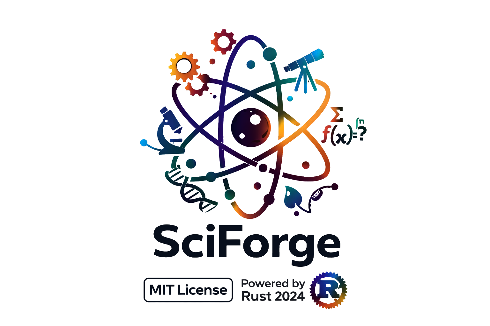

<p align="center">
  
</p>

# SciForge

A comprehensive scientific computing library written in pure Rust with zero external dependencies.

[](LICENSE)
[]()
[]()
[]()
[]()

[Homepage](https://rayanmorel381-beep.github.io/Sciforge/) · [Repository](https://github.com/rayanmorel381-beep/Sciforge) · [Documentation](https://docs.rs/crate/sciforge/latest)

## Overview

SciForge is a scientific computing library covering 11 domains — mathematics, physics, chemistry, biology, geology, astronomy, meteorology — structured as a Cargo workspace of independent crates with zero external dependencies.

It also provides a centralized orchestration system (Hub), a benchmark engine with multi-format export, a parser supporting 6 file formats, and a complete periodic table dataset (118 elements, IUPAC 2024).

### Key Figures

| | |
|---|---|
| Rust source files | 804 |
| Test files | 172 |
| Unit and integration tests | 823 |
| Scientific submodules | 126 |
| Published physical constants | ~527 |
| Periodic table elements | 118 |
| External dependencies | 0 |
| Clippy warnings | 0 |
| `#[allow]` directives | 0 |

## Principles

- **Zero dependencies** — everything is implemented in pure Rust, including parsers, the HTTP server, and binary encoding.
- **Zero comments** — code is designed to be self-explanatory; documentation lives in `docs/`.
- **Zero warnings** — no `#[allow]` directives, no clippy warnings tolerated.
- **Pure functions** — clear signatures, no hidden state, no side effects.

## Installation

```toml
# Default — lib + hub
[dependencies]
sciforge = "0.0.4"

# Full — all crates
[dependencies]
sciforge = { version = "0.0.4", features = ["full"] }

# Individual features
[dependencies]
sciforge = { version = "0.0.4", features = ["aeronaval", "automotive"] }
```

| Feature | Crate |
|---|---|
| `lib` *(default)* | `sciforge-lib` — all scientific modules |
| `hub` *(default)* | `sciforge-hub` — orchestration, dispatch, API |
| `aeronaval` | `sciforge-aeronaval` |
| `automotive` | `sciforge-automotive` |
| `core` | `sciforge-core` |
| `components` | `sciforge-components` |
| `heavy` | `sciforge-heavy` |
| `full` | all of the above |

## Modules

### Constants — Physical Constants and Element Data

6 submodules. ~527 published constants covering CODATA fundamental constants ($c$, $G$, $h$, $\hbar$, $k_B$, $N_A$, $e$, $\varepsilon_0$, $\mu_0$, $\sigma_{SB}$, $\alpha$, Planck units), astronomical constants (AU, parsec, solar/Earth parameters, Hubble constant), atomic constants (particle masses, Bohr radius, Rydberg energy, magnetons), unit conversion factors (eV↔J, cal↔J, atm↔Pa, deg↔rad, barn, ångström), and the full periodic table (118 elements loaded from YAML via `OnceLock`).

### Mathematics — Numerical Methods and Pure Mathematics

17 submodules: complex arithmetic, linear algebra (Gauss elimination, LU/Cholesky decomposition, eigenvalues), calculus (symbolic differentiation, Simpson/Gauss quadrature, automatic differentiation), ODE solvers (Euler, RK4, adaptive RK45), Fourier and Laplace transforms, statistics (descriptive, distributions, hypothesis testing), probability, number theory (primes, GCD, modular arithmetic), combinatorics, set theory, graph theory (BFS, DFS, Dijkstra, Kruskal), geometry (2D/3D transforms, convex hull), trigonometry, polynomial operations, vector calculus (gradient, divergence, curl, Stokes' theorem), and special functions (Gamma, Beta, Bessel, error function).

### Physics — Classical and Modern Physics

12 submodules: acoustics (wave equation, Doppler, decibels, resonance), electrodynamics (Maxwell's equations, Lorentz force, Poynting vector), electronics (Ohm's law, RC/RL/RLC circuits, transistors, op-amps), fluid mechanics (Navier-Stokes, Bernoulli, Reynolds number, drag), materials science (stress-strain, Young's modulus, Hooke, creep), nucleosynthesis (binding energy, decay chains, pp-chain, CNO cycle), optics (Snell, thin lenses, diffraction, interference, polarization), quantum mechanics (Schrödinger equation, particle-in-a-box, harmonic oscillator, hydrogen atom, tunneling), relativity (Lorentz transforms, $E = mc^2$, time dilation, Schwarzschild metric), solid mechanics (beam bending, torsion, Mohr's circle, buckling), thermodynamics (laws of thermodynamics, Carnot cycle, entropy, heat transfer, blackbody radiation), and particle physics (Planck units, Hawking temperature, weak/strong couplings, QCD running, Compton time).

### Chemistry — Physical, Analytical, and Computational Chemistry

26 submodules: acid-base equilibria (Henderson-Hasselbalch, polyprotic titrations), kinetics (Arrhenius, Eyring, Lindemann), electrochemistry (Nernst, Butler-Volmer, Tafel), thermochemistry (Hess's law, Kirchhoff), gas laws (van der Waals, virial, compressibility), quantum chemistry (Hartree-Fock, DFT, Slater determinants), crystallography (Bragg's law, Miller indices, 14 Bravais lattices), molecular modeling (Lennard-Jones, Morse potential, VSEPR), colloids (DLVO theory, Stokes-Einstein), green chemistry (atom economy, E-factor), and environmental chemistry (Henry's law, BOD/COD).

### Biology — The Largest Scientific Module

44 submodules covering: aging (Gompertz/Weibull mortality, telomere dynamics), bioelectricity (Nernst, Goldman-Hodgkin-Katz, Hodgkin-Huxley), bioenergetics (ATP yield, Kleiber's law), biomechanics (Poiseuille flow, Hill muscle model), biophysics (Helfrich membrane, WLC, FRET), biostatistics (Kaplan-Meier, meta-analysis), ecology (Lotka-Volterra, Rosenzweig-MacArthur), enzyme kinetics (Michaelis-Menten, Hill, inhibition), evolution (molecular clock, dN/dS, coalescent), genetics (Hardy-Weinberg, $F_{ST}$), immunology (affinity maturation), neuroscience (integrate-and-fire), pharmacology (PK/PD, hepatic clearance), population dynamics (Leslie matrix, SIR/SEIR), synthetic biology (toggle switch, repressilator, FBA), virology (quasispecies, error catastrophe), and 28 more submodules.

### Geology — Earth Sciences and Geophysics

10 submodules: radiometric dating (decay law $N(t) = N_0 e^{-\lambda t}$, half-life conversion, isochron method, $^{14}$C calibration), petrology (CIPW norm, magma viscosity, Stokes settling, crystallization sequences), seismology (P/S/surface wave propagation, Gutenberg-Richter, Omori aftershock law, magnitude scales $M_L$/$M_W$/$m_b$, focal mechanisms), tectonics (plate velocity on a sphere, Euler poles, Byerlee's friction law, thermal subsidence), erosion, geomorphology, glaciology, hydrology, mantle dynamics, and volcanism.

### Astronomy — Astrophysics and Cosmology

9 submodules: celestial mechanics (ecliptic/equatorial/galactic coordinate transforms, Julian date, sidereal time, nutation), cosmology (direct $E(z)$ parameterizations, $H(z)$ evaluation, comoving/luminosity/angular-diameter distances in ΛCDM/wCDM/CPL, dark-energy equation-of-state models), orbital dynamics (Kepler's laws, vis-viva, Hohmann transfers, orbital perturbations), stellar physics (HR diagram, luminosity-mass-radius relations, main-sequence lifetime, stellar nucleosynthesis), galactic dynamics, impacts, planetary science, rotation and tides.

### Meteorology — Atmospheric Sciences

8 submodules: atmosphere (barometric formula, ISA standard layers, pressure altitude, scale height, lapse rates), dynamics (geostrophic/gradient wind, Rossby number, vorticity, thermal wind, Ekman spiral, CAPE/CIN, Richardson number), precipitation (Clausius-Clapeyron, Köhler theory, Marshall-Palmer DSD, $Z$–$R$ relations, terminal velocity, Bergeron process), radiation (Planck blackbody, Wien's law, Stefan-Boltzmann, solar zenith angle, Beer-Lambert atmospheric extinction, albedo, greenhouse radiative forcing $\Delta F = 5.35 \ln(C/C_0)$), cloud microphysics, ocean-atmosphere interactions, storms, and winds.

## Hub — Centralized Orchestration

The Hub is SciForge's central orchestration layer. It provides a unified API for running scientific experiments across all domains through a dispatch system.

### Architecture

| Component | Role |
|---|---|
| **API** | CLI, DTOs (`ComputeRequest`/`ComputeResponse`), HTTP server (`TcpListener`), routes |
| **Domain** | Dispatchers for all 7 scientific modules + cross-domain (astrochemistry, geophysics, astrophysics, biochemistry, biophysics, geochemistry, astrobiology, etc.) |
| **Engine** | `Experiment` builder, `ExperimentRunner`, `DynamicalSystem` (ODE), scheduler with topological sort, campaign batch execution |
| **Tools** | Arena allocator, profiler, determinism, validation, visualization |
| **Prelude** | Ergonomic re-exports |

### Supported Domains

**19 domains**:

```
Maths · Physics · Chemistry · Biology · Astronomy · Geology · Meteorology
Astrochemistry · Geophysics · Astrophysics · Biochemistry · Biophysics
Geochemistry · Astrobiology · AtmosphericChemistry · AtmosphericPhysics
PlanetaryGeology · Biomathematics · MathematicalPhysics
```

### Parameter Types

**14 parameter types**:

```
Scalar(f64) · Integer(i64) · Vector(Vec<f64>) · Matrix(Vec<Vec<f64>>)
Boolean(bool) · Text(String) · Complex(f64, f64) · ComplexVector
Polynomial · IntVector · IntMatrix · EdgeList · Sparse · Tensor
```

### Usage Example

```rust
use sciforge_hub::prelude::*;

let experiment = Experiment::new(DomainType::Astronomy, "hubble_at_z_lcdm")
    .param("h0", ParameterValue::Scalar(67.4))
    .param("omega_m", ParameterValue::Scalar(0.315))
    .param("z", ParameterValue::Scalar(1.0));

let result = ExperimentRunner::new().run(&experiment)?;
```

## Parser — Zero-Dependency Multi-Format Parsing

6 supported formats, 26 source files, layered `Cursor<'a>` architecture with zero-copy `&'a str` borrowing.

| Format | Standard | Details |
|---|---|---|
| **CSV** | RFC 4180 | `CsvValue` (Table/Record/Field), quoted field handling, writer |
| **JSON** | RFC 8259 | `JsonValue` (6 variants), number/string submodules |
| **YAML** | — | `YamlValue`, indent-based `LineCursor`, scalar type auto-detection — used to load periodic table data |
| **HTML** | — | `HtmlValue` (Document/Element/Text/Comment), named entity decoding — used by Benchmark export |
| **Markdown** | — | `MdValue` (9 block-level variants), inline emphasis, links, code |
| **TOML** | — | 10 functions, 5 structs, 3 enums, 3 constants |

## Benchmark — Performance Engine and Export

The benchmark module provides a complete performance measurement engine with:

- `BenchmarkMetrics`: 30+ field struct with statistical aggregation
- Compact binary encoding (magic header, LE layout, 168+ byte records)
- Zero-copy decoding via `BenchmarkMetricsView`
- Simulation framework with `SimState`/`SimConfig`/`StepFn` traits
- Multi-format report generation (CSV, Markdown, HTML, JSON, YAML, TOML)
- Interactive HTML dashboard with IUPAC 2024 periodic table grid, click-to-detail element cards, SVG chart visualizations, tabbed file browser

## Periodic Table

118 YAML data files organized by IUPAC category under `tableau-periodique/`:

```
tableau-periodique/
├── actinides/
├── elements-superlourds/
├── gaz-nobles/
├── halogenes/
├── lanthanides/
├── metalloides/
├── metaux-alcalino-terreux/
├── metaux-alcalins/
├── metaux-de-transition/
├── metaux-post-transition/
└── non-metaux/
```

Data is loaded at runtime by the Constants module via the internal YAML parser and cached with `OnceLock`.

## Documentation

Documentation is organized in two complementary layers:

| Layer | Path | Content |
|---|---|---|
| Scientific | `docs/modules/` | Concepts, formulas, assumptions, modeled phenomena |
| Implementation | `docs/code/` | Rust API, structs, signatures, execution flow |
| Index | `docs/Summary.md` | Entry point mapping each module guide to its code guide |

Start with `docs/modules/` for scientific context, then `docs/code/` for implementation details.

## Project Structure

```
src/
└── lib.rs                   thin facade — re-exports workspace crates by feature flag

crates/
├── lib/                     sciforge-lib — all scientific modules
│   └── src/
│       ├── constants/       6 submodules — physical constants and element data
│       ├── maths/           17 submodules — numerical methods and pure mathematics
│       ├── physics/         12 submodules — classical and modern physics
│       ├── chemistry/       26 submodules — physical, analytical, computational chemistry
│       ├── biology/         44 submodules — computational biology
│       ├── geology/         10 submodules — earth sciences
│       ├── astronomy/        9 submodules — astrophysics and cosmology
│       └── meteorology/      8 submodules — atmospheric sciences
├── hub/                     sciforge-hub — orchestration, dispatch, API
├── parser/                  sciforge-parser — 6 format parsers
├── benchmark/               sciforge-benchmark — metrics engine
├── core/                    sciforge-core — cross-cutting primitives
├── components/              sciforge-components — physical hardware components
├── automotive/              sciforge-automotive — vehicle science
├── aeronaval/               sciforge-aeronaval — aerospace and naval
├── rail/                    sciforge-rail — rail transport
└── heavy/                   sciforge-heavy — heavy industry

tests/
├── scientific_validation.rs     scientific reference validation suite
├── scientific_properties.rs     property/invariant validation suite
├── benchmark/                   benchmark integration tests
├── parser/                      parser integration tests
├── constants/                   constants tests
├── maths/                       mathematics tests
├── physics/                     physics tests
├── chemistry/                   chemistry tests
├── biology/                     biology tests
├── geology/                     geology tests
├── astronomy/                   astronomy tests
├── meteorology/                 meteorology tests
└── hub/                         orchestration and cross-domain tests

tableau-periodique/              118 YAML element files (IUPAC 2024)
docs/                            scientific and API documentation
output/                          benchmark outputs, organized per domain:
    astronomy/                   bmk/ csv/ json/ toml/ yaml/ + .html .md
    benchmark/                   bmk/ csv/ json/ toml/ yaml/ + .html .md
    biology/                     bmk/ csv/ json/ toml/ yaml/ + .html .md
    chemistry/                   bmk/ csv/ json/ toml/ yaml/ + .html .md
    constants/                   bmk/ csv/ json/ toml/ yaml/ + .html .md
    geology/                     bmk/ csv/ json/ toml/ yaml/ + .html .md
    hub/                         bmk/ csv/ json/ toml/ yaml/ + .html .md
    maths/                       bmk/ csv/ json/ toml/ yaml/ + .html .md
    meteorology/                 bmk/ csv/ json/ toml/ yaml/ + .html .md
    parser/                      bmk/ csv/ json/ toml/ yaml/ + .html .md
    physics/                     bmk/ csv/ json/ toml/ yaml/ + .html .md
    validation/                  bmk/ csv/ json/ toml/ yaml/ + .html .md
```

## Examples

8 runnable examples under `examples/`, each using the benchmark engine with multi-format export to `output/examples/`.

| Example | Domain | Description |
|---|---|---|
| `periodic_table` | Constants | 118 elements with grid positioning, multi-precision benchmark |
| `solar_system` | Astronomy | Orbital mechanics (Kepler periods, orbital velocities) for 8 planets |
| `chemical_reactions` | Chemistry | Stoichiometry and bond energies for 8 reactions |
| `star_catalog` | Astronomy | Stellar luminosity, magnitude, spectral classification for 10 stars |
| `weather_station` | Meteorology | Atmospheric calculations (pressure, dew point) for 10 stations |
| `radioactive_decay` | Chemistry | Decay chains and nuclear energy for radioactive isotopes |
| `unit_converter` | Hub | SI/CGS unit conversions (length, temperature, mass, pressure) |
| `geological_ages` | Geology | Radiometric dating (U-Pb, K-Ar) on geological samples |

```bash
cargo run --example periodic_table
cargo run --example solar_system
cargo run --example chemical_reactions
cargo run --example star_catalog
cargo run --example weather_station
cargo run --example radioactive_decay
cargo run --example unit_converter
cargo run --example geological_ages
```

## Building and Testing

```bash
cargo build
cargo test
cargo clippy
```

Dedicated test targets include: `benchmark`, `parser`, `constants`, `maths`, `physics`, `chemistry`, `biology`, `geology`, `astronomy`, `meteorology`, `hub`, `scientific_validation`, and `scientific_properties`.

## Contributing

See [Contributing.md](Contributing.md) for guidelines.

## Roadmap

See [ComingSoon.md](ComingSoon.md) for the roadmap.

## Changelog

See [ChangeLog.md](ChangeLog.md) and [ChangeLog/](ChangeLog/) for detailed per-module history.

## License

[MIT](LICENSE)
